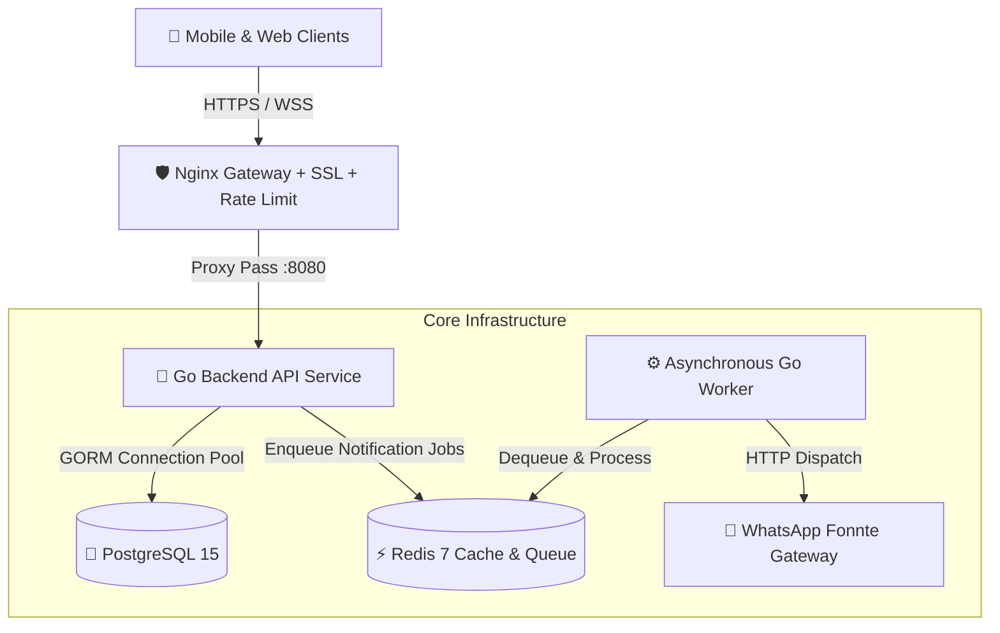

<div align="center">

# ⚡ AntrianGO Backend
### Enterprise-Grade Smart Queue Management & Customer CRM Engine

[](https://go.dev)
[](https://gin-gonic.com)
[](https://www.postgresql.org)
[](https://redis.io)
[](https://www.docker.com)
[](LICENSE)

<p align="center">
  <b>High-throughput, event-driven REST API engineered in Golang</b><br>
  Empowering automotive service centers with real-time queuing, intelligent WhatsApp CRM automation, and multi-tenant branch orchestration.
</p>

[Explore API Endpoints](#-api-endpoints-overview) • [System Architecture](#-tech-stack--architecture) • [Quick Start](#-quick-start) • [Security & Hardening](#4--enterprise-security--hardening)

</div>

---

## 🌟 Executive Summary

**AntrianGO** is a high-performance, fault-tolerant queue management and customer relationship backend platform designed specifically for multi-branch automotive networks. Built with **Go** and **Clean Architecture**, it decouples intense synchronous HTTP traffic from asynchronous broadcast and notification pipelines using **Redis Queue Workers**.

### 💡 Why AntrianGO?
- ⚡ **Ultra-Low Latency:** Sub-millisecond response times powered by Go 1.25 concurrency and Gin.
- 📬 **Event-Driven Messaging:** Background workers processing customer WhatsApp updates without blocking API threads.
- 🏢 **Multi-Branch Multi-Tenancy:** Branch-scoped authorization isolating service data per location with Super Admin oversight.
- 🔒 **Zero-Trust Security:** Hardened CORS policy, HMAC JWT signature validation, and Nginx rate-limiting shields.

---

## 🛠️ Tech Stack & Architecture



### 📦 Key Technologies
| Component | Technology | Purpose |
| :--- | :--- | :--- |
| **Language** | Go (Golang 1.25) | Core microservice engine & async worker |
| **HTTP Engine** | Gin Web Framework | High-performance routing & middleware pipeline |
| **Persistence** | PostgreSQL 15 + GORM | Relational transactional datastore with connection pooling |
| **Message Broker** | Redis 7 | Job queuing for notifications & distributed caching |
| **Reverse Proxy** | Nginx Alpine | TLS/SSL termination, HSTS, Rate limiting |
| **Containerization**| Docker & Docker Compose | Containerized multi-stage reproducible deployment |

---

## 🚀 Core Capabilities

### 1. 🎟️ Smart Queue & Ticket Dispatch
- Instant queue reservation with automatic estimation algorithm.
- Live public board endpoints (sanitized for data privacy).
- Admin real-time next-caller dispatching and ticket completion tracking.

### 2. 🤖 Automated CRM & WhatsApp Hub
- Automated WA status notifications upon ticket transitions (*Menunggu* → *Dipanggil* → *Selesai*).
- Targeted broadcast campaigns (service reminders, promotions, and branch announcements).
- Redis-backed background worker ensuring guaranteed job delivery with retry resiliency.

### 3. 🏢 Multi-Tenant Branch Governance
- Dedicated workspace per branch location.
- Strict role isolation (`user`, branch-scoped `admin`, and global `super_admin`).
- Dynamic branch assignments and staff management.

### 4. 🛡️ Enterprise Security & Hardening
- **HMAC Signature Enforcement:** Defends against JWT algorithm switching attacks.
- **Strict Origin Whitelisting:** Verified domain validation for cross-origin communications.
- **DDoS / Brute-Force Throttling:** Layer-7 rate limiting on critical authentication endpoints (`10 req/min`).

---

## 📁 Clean Domain-Driven Structure

```text
server-antrian-go/
├── cmd/
│   ├── app/                # Main HTTP API Server entry point
│   ├── worker/             # Asynchronous Redis Queue Worker entry point
│   └── seeder/             # Database seeder utility
├── internal/               # Domain-driven internal business packages
│   ├── antrian/            # Queue lifecycle, estimations & ticket handlers
│   ├── auth/               # Google OAuth, JWT tokens & authentication
│   ├── broadcast/          # Promotional & announcement broadcasting
│   ├── cabang/             # Branch master management & geo coordinates
│   ├── crm/                # WhatsApp customer messaging engine
│   ├── notification/       # Fonnte WhatsApp third-party integration
│   └── user/               # Profile, contact book & user administration
├── pkg/                    # Shared infrastructure modules
│   ├── config/             # Environment & configuration loader
│   ├── database/           # PostgreSQL pool management
│   ├── middleware/         # Auth, Role, CORS & SuperAdmin middlewares
│   ├── redis/              # Redis client, queue manager & worker runner
│   └── utils/              # Crypto hash & standardized API response helpers
├── routes/                 # Route declarations & endpoint groupings
├── deployments/            # Production Dockerfiles, compose specs & envs
└── nginx.conf              # Reverse proxy, SSL & rate limiting configuration
```

---

## ⚡ Quick Start

### Prerequisites
- [Docker](https://docs.docker.com/get-docker/) & [Docker Compose](https://docs.docker.com/compose/)
- [Go 1.25+](https://go.dev/dl/) *(for local development)*

### 1️⃣ Clone & Configure Environment
```bash
git clone https://github.com/rakaascode/server-antrian-go.git
cd server-antrian-go

# Setup production environment
cp deployments/.env.example deployments/.env
nano deployments/.env
```

### 2️⃣ Launch with Docker Compose (One-Liner)
```bash
cd deployments
docker compose up -d --build
```

### 3️⃣ Verify Health & Status
```bash
curl -i http://localhost:8080/
```
```json
{
  "status": "online",
  "app_name": "API Server Antrian Yamaha Lautan Teduh",
  "version": "1.0.0",
  "maintainer": "Lautan Teduh IT Team"
}
```

---

## 📌 API Endpoints Overview

| Method | Path | Access | Description |
| :--- | :--- | :--- | :--- |
| `GET` | `/` | Public | Live System Health & Meta Info |
| `POST` | `/api/auth/google` | Public | User Google OAuth Login / Register |
| `POST` | `/api/auth/admin/login` | Public | Branch / Super Admin Login |
| `GET` | `/api/cabang` | Public | List all active branch locations |
| `GET` | `/api/cabang/:id/antrian` | Public | Public view of real-time branch queue |
| `POST` | `/api/antrian` | User (JWT) | Book a new queue number |
| `GET` | `/api/antrian/me` | User (JWT) | Get personal queue history & active tickets |
| `POST` | `/api/antrian/call-next` | Admin (JWT) | Call the next pending queue ticket |
| `PUT` | `/api/antrian/:id/selesai` | Admin (JWT) | Complete service ticket |
| `POST` | `/api/crm/send` | Admin (JWT) | Direct dispatch WhatsApp message |
| `POST` | `/api/broadcast` | Admin (JWT) | Broadcast promo/update to branch customers |
| `POST` | `/api/super/admin/cabang` | Super Admin | Provision new branch administrator |

---

## 🤝 Contributing & Standards

Contributions are welcome! Please follow standard Go conventions:
1. Fork the Project
2. Create your Feature Branch (`git checkout -b feature/AmazingFeature`)
3. Commit your Changes (`git commit -m 'feat: Add some AmazingFeature'`)
4. Push to the Branch (`git push origin feature/AmazingFeature`)
5. Open a Pull Request

---

## 📄 License & Maintainer

Distributed under the **Apache 2.0 License**. See [`LICENSE`](LICENSE) for more information.

Maintained with ❤️ by **Raka Saputra & Lautan Teduh IT Team**.

